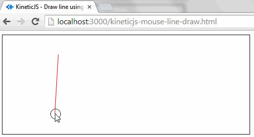

# CANVAS-JS
## Canvas + JS - Reto Platzi

Canvas es un elemento HTML el cual puede ser usado para dibujar gráficos usando scripts (normalmente JavaScript). Este puede, por ejemplo, ser usado para dibujar gráficos, realizar composición de fotos o simples (y no tan simples) animaciones. 

El siguiente ejemplo fue realizado gracias a la plataforma de Platzi.

